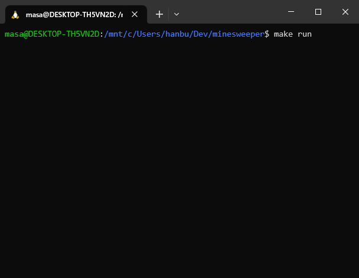

# minesweeper

This project is the game `minesweeper` running in your terminal.

It is written in C on Ubuntu. It may work on other distribution.

For information on how to play, read the manual by selecting it from the menu then press `space`.



## How to build

```bash
cd minesweeper
make
```

## How to execute

```bash
cd minesweeper
make run
```

## How to clean

```bash
cd minesweeper
make clean
```